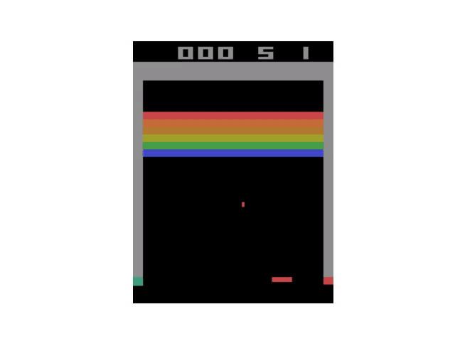
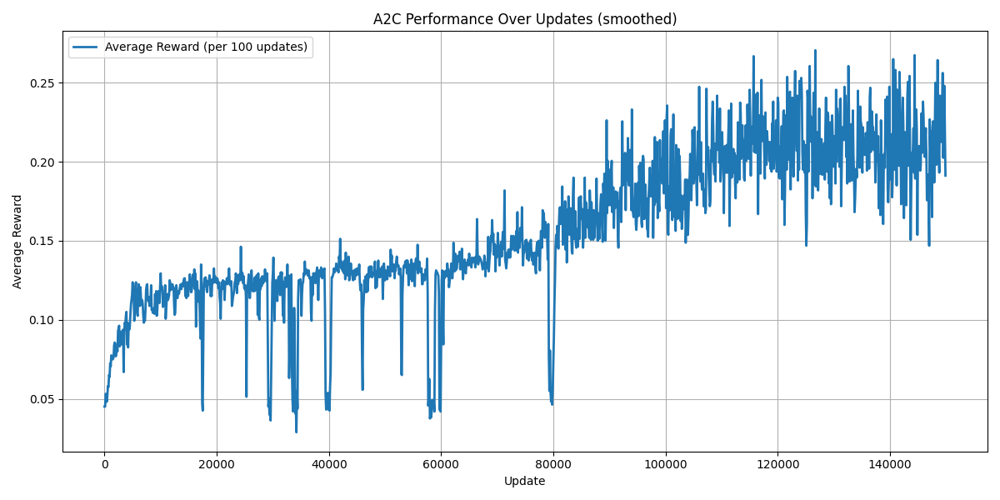

This project implements an **Advantage Actor-Critic (A2C)** agent to solve the BreakoutNoFrameskip-v4(https://www.gymlibrary.dev/environments/atari/breakout/) Atari environment in Stable Baselines 3. The agent is trained using **parallel environments**, **n-step rollouts**, and **entropy regularization** to encourage exploration.

---

## Project Overview
- **Environment:** BreakoutNoFrameskip-v4 (Gymnasium)  
- **Algorithm:** Advantage Actor-Critic (A2C)  
- **State:** 4 stacked grayscale frames of 84×84 pixels  
- **Actions:** 4 discrete actions (NOOP, FIRE, RIGHT, LEFT)  
- **Reward:** Points for breaking bricks. In this environment, bricks have the following values:
  - Red: 7 points  
  - Orange: 7 points  
  - Yellow: 4 points  
  - Green: 4 points  
  - Aqua: 1 point  
  - Blue: 1 point  
- **Goal:** Maximize the total score by breaking as many bricks as possible.  
  - The environment can support **two walls**, but in this project’s experiments (including the GIF), only **one wall** is used.  
  - With **one wall**, the maximum achievable score is **432 points**.

---

## Key Idea: A2C with Parallel n-Step Rollouts
- **Parallel Environments:** Collect experiences from multiple environments simultaneously for stable updates.  
- **Actor-Critic Network:** Convolutional network predicts both **policy (actor)** and **state value (critic)**.  
- **n-Step Returns:** Combines immediate and future rewards to compute advantages.  
- **Entropy Regularization:** Encourages exploration to avoid premature convergence.  
- **Gradient Clipping & Learning Rate Scheduler:** Ensures stable training.

---

## Trained Agent Visualization

  

> The GIF shows the **best episode achieved by the agent** (score: 369).  
> Only **one life** is displayed in the GIF to highlight optimal gameplay.

**Note:** MP4/GIF export requires **FFmpeg installed**. Python packages alone (`matplotlib`, `gymnasium`, `torch`, `numpy`) are sufficient for training, plotting rewards, and in-memory animation.

---

## Training Performance

 

> The plots show the **average total reward per 100 updates**, smoothed to visualize learning progress.

---

## Requirements

- See `requirements.txt` for Python package dependencies.  
- Python 3.11.13 recommended.

---

## Files
- `actor_critic.py` → A2C model and agent implementation
- `agent.py` → Execution script 
- `a2c_policy.gif` → GIF showing the best episode of the trained agent  
- `a2c_training_rewards.png` → Plot of average reward progression over training  
- `a2c_model.pth` → Saved A2C model weights (pretrained, can be reused)  
- `requirements.txt` → Python dependencies
